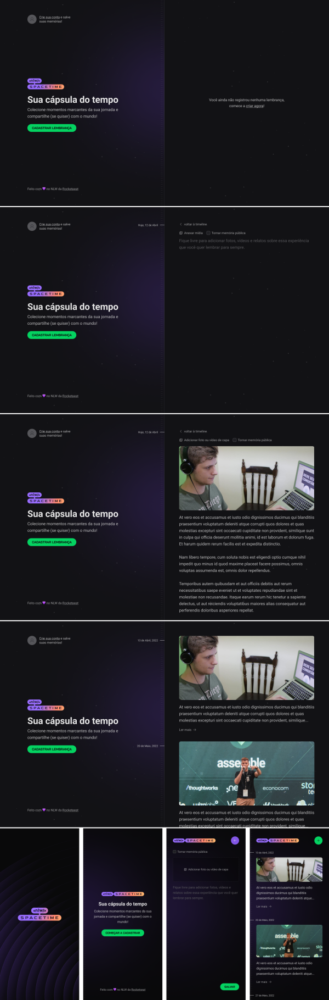
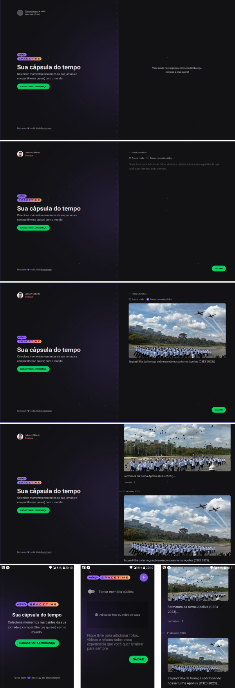

# :rocket::seat: NLW-Spacetime - Ignite Track

[NLW-Spacetime](https://app.rocketseat.com.br/events/nlw-spacetime/) project with Node, Fastify, Prisma, React, NextJS, React Native, Expo, TailwindCSS and Typescript.

## :hammer: Status

> :white_check_mark: Finished :lock:

## :bookmark: Content Table
<!--ts-->
  * [App Interface](#newspaper-app-interface)
  * [Technologies](#books-technologies)
  * [Install and Run](#calling-installing-and-running-this-project)
  * [Author and License](#memo-author-and-license)
<!--te-->

## :newspaper: App Interface
### :iphone: Planned Design

<p align="center"></p>

Based on [Rocketseat's NLW-Spacetime Ignite design](https://www.figma.com/community/file/1240070456276424762). You might need a [Figma](https://figma.com) account to access the design.

### :tada: Final Result

<p align="center"></p>

## :books: Technologies

- [NodeJS](https://nodejs.org/en/)
- [Fastify](https://www.fastify.io/)
- [Prisma](https://www.prisma.io/)
- [React](https://react.dev/)
- [NextJS](https://nextjs.org/)
- [React Native](https://reactnative.dev/)
- [Expo](https://expo.dev/)
- [TailwindCSS](https://tailwindcss.com/)
- [Typescript](https://www.typescriptlang.org/)

## :calling: Installing and running this project

### :wrench: Prerequisites

Before starting, make sure you have [Git](https://git-scm.com/) and [Node](https://nodejs.org/en/) installed. Also, install [Expo Go](https://expo.dev/client) on your phone (or install an [Android emulator](https://developer.android.com/studio/) following [these instructions](https://react-native.rocketseat.dev/virtual-devices/android-emulator)) and create an Expo account.

### :inbox_tray: Install and run

Clone the project using Git, install its dependencies through NPM and run the project:

```bash
git clone https://github.com/jobsonita/rocketseat-nlw-spacetime-ignite.git

# wait for git to finish clonning the project, then navigate to each folder (server, web and mobile) and install their dependencies:

cd rocketseat-nlw-spacetime-ignite

cd server
npm install

cd ..
cd web
npm install

cd ..
cd mobile
npm install

# Finally, run the apps on separate terminals:

# server

npm run dev
# access http://localhost:3333/hello to get the list of registered users (should be empty until you use prisma studio to add some users to the database)


# web

npm run dev
# access http://localhost:3000 to see the landing page


# mobile

npm run start
# Your terminal will display a QR code with which you can connect to your phone through Expo GO and run the application on your phone
```

## :memo: Author and License

[](https://github.com/jobsonita/jobsonita) | [Jobson Gilberto](https://github.com/jobsonita/jobsonita)
-|-

[](LICENSE)
